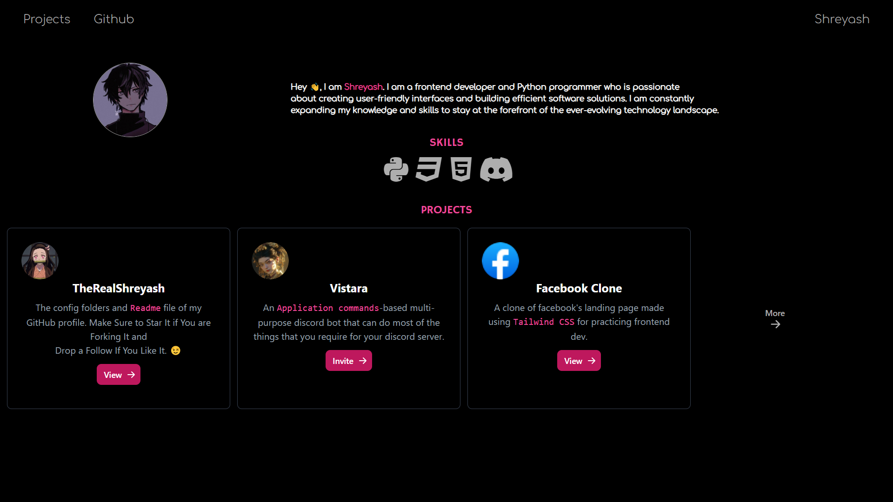

# Personal Portfolio ⚡

> A clean, beautiful, ambient portfolio template for Software Developers!

> https://therealshreyash.github.io


[](https://github.com/TheRealShreyash/therealshreyash.github.io/commits/master)
[](http://therealshreyash.github.io)

## Website Preview

<a href="https://therealshreyash.github.io" target="_blank">
    
</a><br><br>

> Make Sure to ⭐ the Repo if You liked it -- It Helps!

## 📋 Features

⚡️ Open-Source\
⚡️ Valid HTML5 & Tailwind CSS

## 📦 Installation & Deployment

- Clone the repository and modify the content of **index.html** according to your requirements.
- Add or remove images from the `therealshreyash.github.io/assets/` directory as per your needs.
- I highly recommend using [GitHub Pages](https://docs.github.com/en/pages) to deploy the website in the easiest way.
- To deploy your website using GitHub Pages, create a GitHub repository with the name `<your-github-username>.github.io`. Please use this exact name.
- Push the generated code to the `master` branch of this repository.

## 📚 Sections

- [x] About
- [x] Skills
- [x] Projects
- [x] Social Media Links
- [x] Custom 404 Page
- [x] Particle Effect
- [x] Footer

To view a live example, **[click here](https://therealshreyash.github.io/)**

## 🛠️ Tools Used

- [<b>Tailwind CSS</b>](https://tailwindcss.com/)
- [<b>Google Fonts</b>](https://fonts.google.com/)
- [<b>particles.js</b>](https://vincentgarreau.com/particles.js/)

## 🚀 Contributing

### Step 1: Clone The Repo 💡

Fork the repository and then clone it locally by doing -

```bash
git clone https://github.com/TheRealShreyash/therealshreyash.github.io.git
```

### Step 2: Build Your Code 🔨

Start your magic by modifying the code and making changes of your own. Then push the commit using -

```bash
git add .
git commit -m "<your commit message here>"
git push YOUR_REPO_URL develop
```

### Step 3: Create a new pull request 🔃

After cloning & setting up the local project you can push the changes to your github fork and make a pull request (optional).

## 🤗 Special Thanks To

- [tsParticles](https://github.com/tsparticles/404-templates) - For The Custom 404 Page
- [TheKaushikGoswami](https://github.com/TheKaushikGoswami) - For This Readme page

---

Made with ❤ in India
